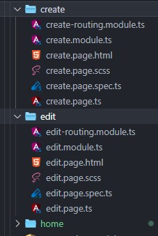
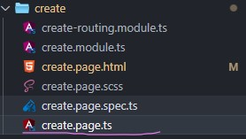
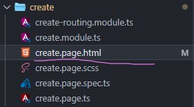
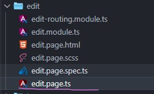
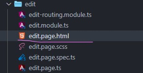
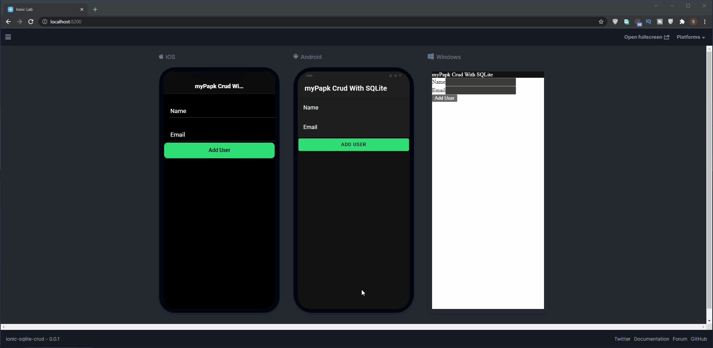

# Ionic 5 With SQLite Storage Plugin – `CRUD`

Dalam praktikum ke - 03 ini, kita akan belajar cara menggunakan penyimpanan SQLite dalam aplikasi Ionic menggunakan plugin [cordova-sqlite-storage](https://ionicframework.com/docs/native/sqlite). 

Jenis penyimpanan SQLite digunakan oleh sebagian besar perangkat Asli seperti android/iOs. Ini adalah sistem manajemen basis data relasional yang tersedia di perangkat itu sendiri untuk menyimpan data lokal di perangkat. 

Kapasitas penyimpanan tergantung pada memori perangkat sehingga menyediakan ruang yang baik untuk melakukan tugas-tugas umum pada perangkat native tersebut.

Dalam perangkat portabel, penyimpanan membantu pengembang untuk menyimpan data lokal seperti pengaturan pengguna, catatan offline, preferensi profil, dll. Aplikasi Hybrid yang dibangun menggunakan Ionic Framework dapat dengan mudah mengakses dan menggunakan sistem penyimpanan Native seperti SQLite. 

Karena pengembang aplikasi terkadang perlu menyimpan banyak informasi di sisi pengguna untuk mengontrol beberapa fitur dan menyediakan beberapa fungsi offline kepada pengguna aplikasi, dalam hal ini, *local storage* terbukti sangat berguna.

Tetapi umumnya data yang disimpan di *localStorage* ini akan tetap ada hingga aplikasi di uninstall atau devices diformat.

OK!, Lanjut Praktikum...... 🤩

- [Ionic 5 With SQLite Storage Plugin – `CRUD`](#ionic-5-with-sqlite-storage-plugin--crud)
- [STEP 1: Configure Ionic Environment](#step-1-configure-ionic-environment)
- [Step 2: Update Routes](#step-2-update-routes)
- [Step 3: Install SQLite Plugin](#step-3-install-sqlite-plugin)
- [Step 4: Update App Module Class](#step-4-update-app-module-class)
- [Step 5: Create SQLite CRUD Service](#step-5-create-sqlite-crud-service)
- [Step 6: Implement Create and Delete](#step-6-implement-create-and-delete)
- [Step 7: Get Data Collection and Display List](#step-7-get-data-collection-and-display-list)
- [Step 8: Implement Update or Edit](#step-8-implement-update-or-edit)
- [Step 9 : Test Project Apps](#step-9--test-project-apps)
- [Referensi](#referensi)
  

# STEP 1: Configure Ionic Environment

Ionic CLI merupakan program atau tool berabasis teks untuk membuat project Ionic, menjalankan server, dan build aplikasi. Oleh karena itu, mulailah dengan menginstallnya. Run command: jalankan perintah berikut:

```bash
npm install -g @ionic/cli
```

Next, install new blank ionic angular app:

```bash
ionic start MyPapk3-sqlite-crud blank --type=angular
```

> Untuk penamaan aplikasi **MyPapk3-sqlite-crud** silahkan disesuaikan dengan selera ya. 🎉

Tunggulah sampai prosesnya selesai. ⏳

Next, open with project dengan text editor & open terminal: masuk dulu ke direktori projectnya dengan perintah cd.

```bash
cd MyPapk3-sqlite-crud
```

Kemudian jalankan perintah:

```bash
ionic serve -l
```

Next, pada praktikum Ke-03 ini kita akan belajar membuat `page` menggunakan perintah `generate` CLI Ionic. Untuk studi kasusnya kita akan buat `2 pages` . Yaitu page menu `create` dan page `edit` .

Buka command line arahkan pada direktori kerja anda kemudian jalankan perintah berikut untuk membuat page baru:

```bash
ng generate page create
ng generate page edit
```

setelah itu akan tercipta folder dengan nama ` create & edit` di dalam folder `src/app/pages/` , 



> Page secara otomatis ditambahkan sebagai nama class page tersebut.

Next, Pastikan untuk menghapus page `Home` karena kita tidak membutuhkannya.


# Step 2: Update Routes

Next, buka pages edit. Update `app-routing.module.ts` : kemudian masukan codingan berikut:

```TypeScript
import { NgModule } from '@angular/core';
import { PreloadAllModules, RouterModule, Routes } from '@angular/router';

const routes: Routes = [
  {
    path: '',
    redirectTo: 'create',
    pathMatch: 'full'
  },
  {
    path: 'create',
    loadChildren: () => import('./create/create.module').then( m => m.CreatePageModule)
  },
  {
    path: 'edit/:id',
    loadChildren: () => import('./edit/edit.module').then( m => m.EditPageModule)
  },
];

@NgModule({
  imports: [
    RouterModule.forRoot(routes, { preloadingStrategy: PreloadAllModules })
  ],
  exports: [RouterModule]
})

export class AppRoutingModule { }
```

# Step 3: Install SQLite Plugin

Perintah di bawah ini akan menambahkan `plugin SQLite` ke aplikasi yang kita buat:

Open terminal, jalankan 3 perintah berikut:

```bash
1. npm install @ionic-native/sqlite

2. ionic cordova plugin add cordova-sqlite-storage

3. npm i @ionic-native/core
```

Tunggulah sampai prosesnya selesai. ⏳

# Step 4: Update App Module Class

Selanjutnya, kita perlu mengimpor plugin SQLite di dalam class module.

Update ` app.module.ts` : kemudian masukan codingan berikut:

```TypeScript
import { NgModule } from '@angular/core';
import { BrowserModule } from '@angular/platform-browser';
import { RouteReuseStrategy } from '@angular/router';

import { IonicModule, IonicRouteStrategy } from '@ionic/angular';

import { AppComponent } from './app.component';
import { AppRoutingModule } from './app-routing.module';

// plugins
import { SQLite } from '@ionic-native/sqlite/ngx';

@NgModule({
  declarations: [AppComponent],
  entryComponents: [],
  imports: [BrowserModule, IonicModule.forRoot(), AppRoutingModule],
  providers: [
    SQLite,
    {
      provide: RouteReuseStrategy,
      useClass: IonicRouteStrategy
    }
  ],
  bootstrap: [AppComponent],
})

export class AppModule {}
```

# Step 5: Create SQLite CRUD Service

Buat new database service dengan menjalankan perintah berikut.

```bash
ng g service crud
```

Pada langkah selanjutnya, kita akan membuat layanan database SQLite yang akan mendukung operasi CRUD yang diperlukan untuk apps yang kita buat.

buka file `crud.service.ts` , perbarui kode-nya dengan codingan berikut:

```TypeScript
import { Injectable } from '@angular/core';
import { Platform } from '@ionic/angular';
import { SQLite, SQLiteObject } from '@ionic-native/sqlite/ngx';

@Injectable({
  providedIn: 'root'
})

export class CrudService {
  // Cofig database
  private dbInstance: SQLiteObject;
  readonly db_name: string = "remotestack.db";
  readonly db_table: string = "userTable";
  USERS: Array <any> ;

  constructor(
    private platform: Platform,
    private sqlite: SQLite
  ) {
    this.databaseConn();
  }

    // Create SQLite database
    databaseConn() {
        this.platform.ready().then(() => {
          this.sqlite.create({
              name: this.db_name,
              location: 'default'
            }).then((sqLite: SQLiteObject) => {
              this.dbInstance = sqLite;
              sqLite.executeSql(`
                  CREATE TABLE IF NOT EXISTS ${this.db_table} (
                    user_id INTEGER PRIMARY KEY,
                    name varchar(255),
                    email varchar(255)
                  )`, [])
                .then((res) => {
                  // alert(JSON.stringify(res));
                })
                .catch((error) => alert(JSON.stringify(error)));
            })
            .catch((error) => alert(JSON.stringify(error)));
        });
    }

    // Proses Crud
    public addItem(n, e) {
      // validation
      if (!n.length || !e.length) {
        alert('Masukan Nama & Email Anda');
        return;
      }
      this.dbInstance.executeSql(`
      INSERT INTO ${this.db_table} (name, email) VALUES ('${n}', '${e}')`, [])
        .then(() => {
          alert("Success");
          this.getAllUsers();
        }, (e) => {
          alert(JSON.stringify(e.err));
        });
    }

    getAllUsers() {
      return this.dbInstance.executeSql(`SELECT * FROM ${this.db_table}`, []).then((res) => {
        this.USERS = [];
        if (res.rows.length > 0) {
          for (var i = 0; i < res.rows.length; i++) {
            this.USERS.push(res.rows.item(i));
          }
          return this.USERS;
        }
      },(e) => {
        alert(JSON.stringify(e));
      });
    }

    // Get user
    getUser(id): Promise<any> {
      return this.dbInstance.executeSql(`SELECT * FROM ${this.db_table} WHERE user_id = ?`, [id])
      .then((res) => {
        return {
          user_id: res.rows.item(0).user_id,
          name: res.rows.item(0).name,
          email: res.rows.item(0).email
        }
      });
    }

    // Update
    updateUser(id, name, email) {
      let data = [name, email];
      return this.dbInstance.executeSql(`UPDATE ${this.db_table} SET name = ?, email = ? WHERE user_id = ${id}`, data)
    }

    // Delete
    deleteUser(user) {
      this.dbInstance.executeSql(`
      DELETE FROM ${this.db_table} WHERE user_id = ${user}`, [])
        .then(() => {
          alert("User deleted!");
          this.getAllUsers();
        })
        .catch(e => {
          alert(JSON.stringify(e))
        });
    }

}
```

Kita harus melakukan beberapa tugas menggunakan service file tersebut; 
pertama `import Platform` , `SQLite` dan `SQLiteObject` modul. Ini sangat penting untuk membuat dan menyiapkan koneksi database SQLite ketika platform sudah siap.

Untuk menangani operation CRUD di database SQLite, menggunakan beberapa method seperti `executeSql()` . `addItem()` , `getAllUsers()` , `getUser()` , `updateUser()` dan `deleteUser()` untuk menangani operation CRUD.

# Step 6: Implement Create and Delete

Pada langkah ini, kita akan belajar menerapkan cara membuat dan menampilkan fitur daftar di halaman apps Ionic menggunakan SQLite.

Kita akan menambahkan form dasar untuk memungkinkan pengguna memasukkan data seperti `nama` dan ` email` menggunakan `ngModel` .

`CrudService ` digunakan untuk mengimport & menambahkan ke dalam method _constructor_, membuat, mengambil & menghapus daftar pengguna dari db SQLite.

Tambahkan codingan berikut ke file `create.page.ts` :

```TypeScript
import { Component, OnInit } from '@angular/core';
import { CrudService } from '../crud.service';

@Component({
  selector: 'app-create',
  templateUrl: './create.page.html',
  styleUrls: ['./create.page.scss'],
})

export class CreatePage implements OnInit {

  nameVal: string = "";
  emailVal: string = "";

  constructor(
   private crud: CrudService
  ) {
    this.crud.databaseConn();
  }

  ngOnInit() { }

  ionViewDidEnter() {
    this.crud.getAllUsers()
  }

  createUser(){
    this.crud.addItem(this.nameVal, this.emailVal);
  }

  remove(user) {
    this.crud.deleteUser(user);
  }

}
```



# Step 7: Get Data Collection and Display List

Untuk menampilkan collection data, gunakan direktif `ngFor` fungsi ini digunakan untuk menampilkan data user ke dalam item komponen UI ionic.

Tambahkan codingan berikut ke file `create.page.html`

```html
<ion-header>
    <ion-toolbar>
        <ion-title>myPapk Crud With SQLite</ion-title>
    </ion-toolbar>
</ion-header>

<ion-content>
    <!-- Create -->
    <ion-item>
        <ion-label position="floating">Name</ion-label>
        <ion-input [(ngModel)]="nameVal"></ion-input>
    </ion-item>

    <ion-item>
        <ion-label position="floating">Email</ion-label>
        <ion-input [(ngModel)]="emailVal"></ion-input>
    </ion-item>

    <ion-button color="success" expand="block" (click)="createUser()">
        Add User
    </ion-button>

    <!-- Read -->
    <ion-item *ngFor="let user of crud.USERS">
        <ion-label>
            <h2><strong>{{ user.name }}</strong></h2>
            <p>{{ user.email }}</p>
        </ion-label>

        <div class="item-note" item-end>
            <ion-icon color="primary" name="create" style="zoom:1.3" [routerLink]="['/edit/', user.user_id]"></ion-icon>

            <ion-icon color="danger" name="trash" style="zoom:1.3" (click)="remove(user.user_id)"></ion-icon>
        </div>
    </ion-item>
</ion-content>
```



# Step 8: Implement Update or Edit

Terakhir, kita akan mengimplementasikan fitur edit/update jadi pastikan untuk membuat form dan memasukkan nilai dengan menggunakan `angular service` .

Selain itu, kita akan menggunakan `ActivatedRoute api` untuk mendapatkan `id ` pengguna dari url, dan itu diteruskan ke metode `getUser()` .

dan ini akan menampilkan objek pengguna dari database SQLite, selanjutnya kita akan menggunakan metode `updateUser()` untuk memperbarui data pengguna.

Tambahkan codingan berikut ke file `edit.page.ts`

```TypeScript
import { Component, OnInit } from '@angular/core';
import { CrudService } from '../crud.service';
import { ActivatedRoute, Router } from "@angular/router";

@Component({
  selector: 'app-edit',
  templateUrl: './edit.page.html',
  styleUrls: ['./edit.page.scss'],
})

export class EditPage implements OnInit {
  id: any;
  nameVal: string = "";
  emailVal: string = "";

  constructor(
    private router: Router,
    private activatedRoute: ActivatedRoute,
    private crud: CrudService
  ) {
    this.id = this.activatedRoute.snapshot.paramMap.get('id');

    this.crud.getUser(this.id).then((res) => {
      this.nameVal = res['name'];
      this.emailVal = res['email'];
    })
  }

  ngOnInit() { }

  onUpdate() {
     this.crud.updateUser(this.id, this.nameVal, this.emailVal).then(() => {
        this.router.navigate(['/create']);
     })
  }

}
```



Selanjutnya..

Open and update `edit.page.html` file:

```html
<ion-header>
    <ion-toolbar>
        <ion-buttons slot="start">
            <ion-back-button></ion-back-button>
        </ion-buttons>
        <ion-title>Edit</ion-title>
    </ion-toolbar>
</ion-header>

<ion-content>
    <ion-item>
        <ion-label position="floating">Name</ion-label>
        <ion-input [(ngModel)]="nameVal"></ion-input>
    </ion-item>

    <ion-item>
        <ion-label position="floating">Email</ion-label>
        <ion-input [(ngModel)]="emailVal"></ion-input>
    </ion-item>

    <ion-button color="dark" expand="block" (click)="onUpdate()">
        Update
    </ion-button>
</ion-content>
```



# Step 9 : Test Project Apps

Untuk menjalankan Development Server. Pastikan sudah berada pada direktori apps kita, lalu ketikan perintah berikut:

```bash
ionic serve -l
```



Perintah di atas berfungsi untuk menjalankan apps ionic di browser dengan `ionic lab`

Selamat, 🌟🌟

Sampai tahap ini kalian sudah belajar mengimplementasikan **Operation CRUD Ionic With SQLite Cordova Plugin Offline Storage.** Yang dapat kita gunakan untuk menyimpan dan mengelola data untuk membangun mobile apps.

⚠ **Harap di perhatikan:** ketika apps tersebut di Run di **dev server** belum bisa melakukan proses CRUD. 

Jadi, Proses CRUD tersebut akan berjalan hanya di perangkat asli/native. 🤳📱ph

**Apa Selanjutnya?** 🤩

Di pertemuan selanjutnya kita akan belajar cara **bulid** aplikasi tersebut ke android. dan nantinya akan kita tes di `real devices` ... 

# Referensi

1. https://ionicframework.com/blog/announcing-ionic-5/
2. https://ionicframework.com/docs/developing/android
3. https://ionicframework.com/docs/native/sqlite
