<h2> Build an Android app with Ionic </h2>


Dalam pertemuan ke - 4 ini kita akan mempelajari bagaimana build project ionic framework ke app android.

Dokumentasi resmi Ionic 5 merekomendasikan penggunaan Android Studio untuk _mem-build_ project.[[1]](#1). 

Namun sebenarnya ada alternative lain tanpa meng-install android studio-pun kita sudah bisa bulid project ionic ke _apk-flies_. Karena kita tahu Android Studio relatif membutuhkan banyak _resource_. 😆

Tapi disini saya akan bahas terlebih dahulu sesuai dokumentasi resmi ionic ya. ✅

*let's get started ..* 

- [Step 1: Install Android studio in the system :](#step-1-install-android-studio-in-the-system-)
- [Step 2: Setup _environment variable_ pada sistem.](#step-2-setup-environment-variable-pada-sistem)
- [Step 3: Generate APK dari Ionic project](#step-3-generate-apk-dari-ionic-project)
    - [Ok, Yang terakhir?](#ok-yang-terakhir)
- [Conclusion](#conclusion)
- [Referensi](#referensi)

## Step 1: Install Android studio in the system : 

- [x] [Android Studio](https://developer.android.com/studio) `download`

Selanjutnya buka android studio kalian `Click on SDK Manager` di pojok kanan kemudian check bagian `SDK-Paltform`, `SDK-TOOLS` dan `SDK-Update Sites`

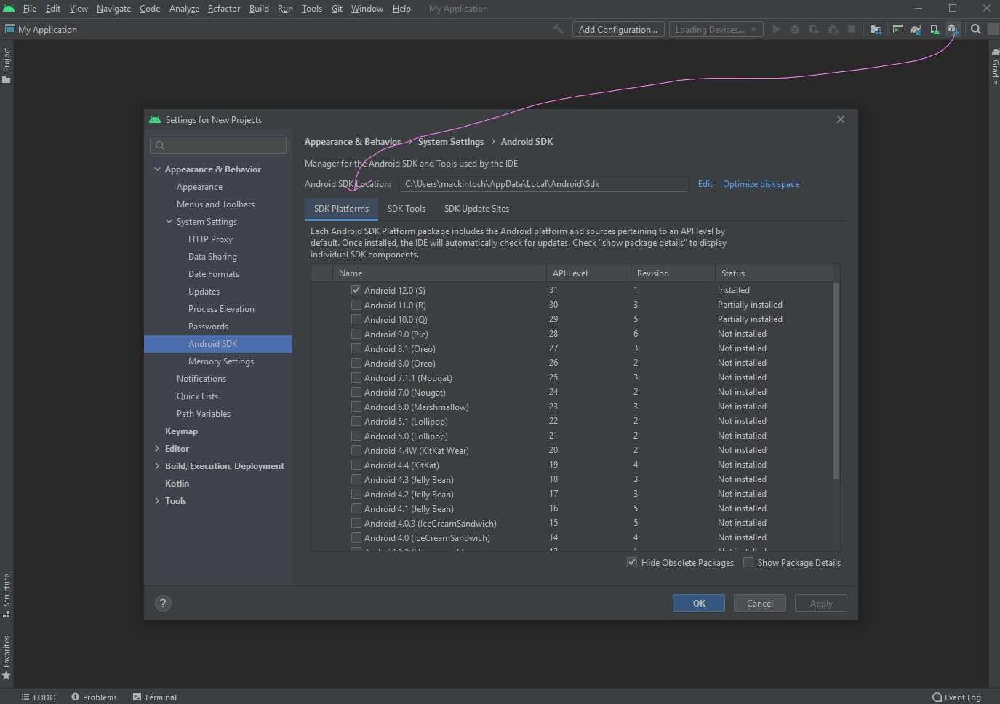

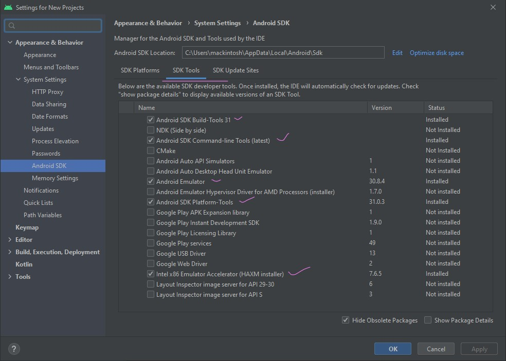

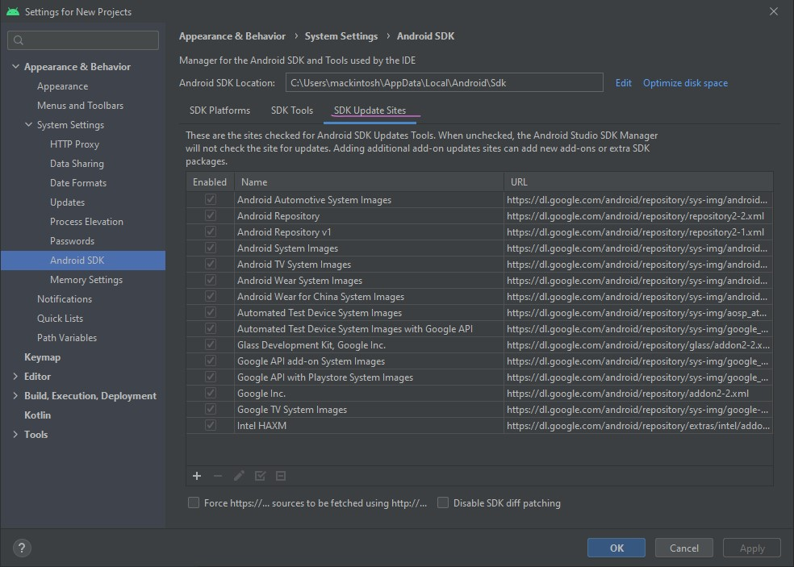

Setelah mengiinstall ini. Sekarang kita dapat melanjutkan ke bagian _setup environment variable_.


## Step 2: Setup _environment variable_ pada sistem.

Atur variabel berikut:  

1. **Android SDK**

Sebelum mengatur _environment variable_ di sistem silahkan anda check direktori path untuk Android-SDK, default-nya ada di : `C:\Users\mackintosh\AppData\Local\Android\Sdk`.

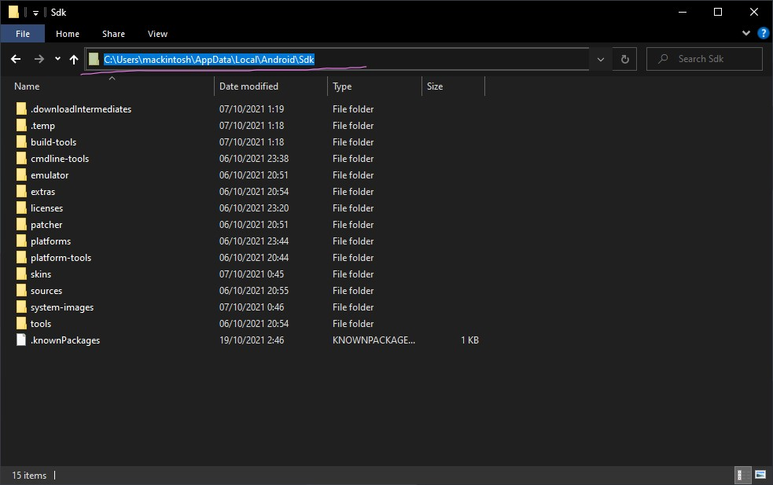

`dirPath` tersebut biasnya _hidden_. untuk memunculkannya silakan klik menu berikut:

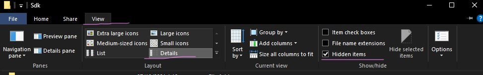

Selanjutnya `Klik New` untuk setup _environment variables system_ Seperti pada gambar berikut:

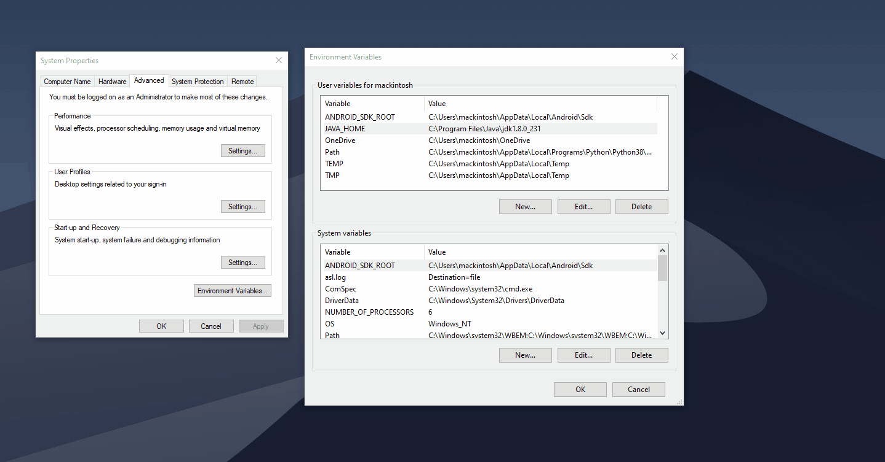


- **User variables:**

```bash
Variable : ANDROID_SDK_ROOT
```

Value:

```bash
C:\Users\mackintosh\AppData\Local\Android\Sdk
```

- **System Variables**

```bash
Variable : ANDROID_SDK_ROOT
```

Value:

```bash
C:\Users\mackintosh\AppData\Local\Android\Sdk
```

Selanjutnya edit `path` di `system variables` klik _New_ `addDirpath` untuk` SDK` :

```bash
build-tools : C:\Users\mackintosh\AppData\Local\Android\Sdk\build-tools
```

```bash
platform-tools : C:\Users\mackintosh\AppData\Local\Android\Sdk\platform-tools
```
2. **Java JDK**

Kemudian untuk `Java JDK`setup nya sama

- **User variables:**

```bash
Variable : JAVA_HOME
```

Value:

```bash
C:\Program Files\Java\jdk1.8.0_231
```

- **System Variables**

```bash
AddDirPath : C:\Program Files\Java\jdk1.8.0_231\bin
```

3. **Gradle**

Download dan extract [Gradle](https://gradle.org/next-steps/?version=6.9.1&format=bin), [[2]](#2). ke drive C:

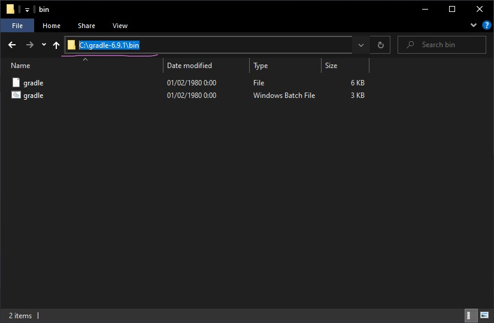


kemudian `addDirpath` ke _systems variables_ `Path.`

```bash
AddDirPath : C:\gradle-6.9.1\bin
```

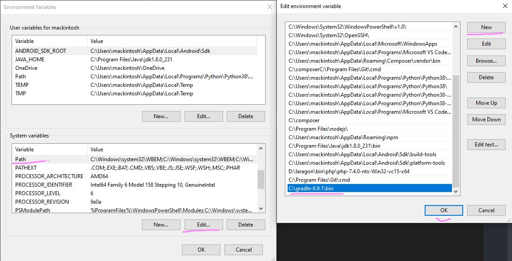

Klik "OK" Kemudian Restart PC/Laptop anda.

## Step 3: Generate APK dari Ionic project

Pada langkah terakhir, kita perlu menkonfigurasikan _Platform_, Anda perlu menambahkan [ionic cordova platform](https://ionicframework.com/docs/cli/commands/cordova-platform) ke aplikasi Anda. untuk lebih lengkap tentang perintah _CLI cordova platform targets_ bisa cek di dokumentasi resminya: [cordova-platform](https://ionicframework.com/docs/cli/commands/cordova-platform).

karena di project ini kita akan deploy ke `android platform`: maka perintah untuk membangun aplikasi ionic dan menggenerate APK nya menggunakan perintah berikut:

Include the platform:

```bash
# iOS
ionic cordova platform add ios

# Android
ionic cordova platform add android

# Windows
ionic cordova platform add windows
```

Lanjut, 👉 <code>Buka kembali project ionic kalian</code> 📂

Arahkan ke project yang dibuat sebelumnya lalu jalankan perintah:

```bash
# Print system/environment info
ionic info
```

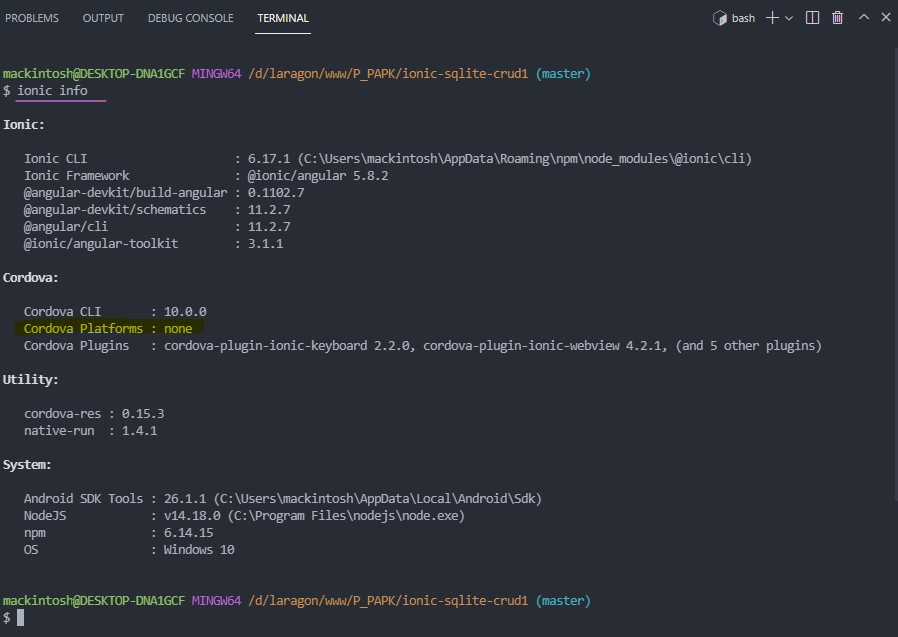

Perintah di atas adalah untuk check apakah _environment_ sistem nya sudah terinstal dengan benar.

Coba sekarang lihat ke` Cordova: Cordova platform : none` di sana status nya masih `none`. itu menandakan bawha kita belum menambahkan `platform` dalam project ionic kita.

Sekarang mari kita tambahkan `platform android` ke project kita. gunakan perintah berikut:

```bash
ionic cordova platform add android
```
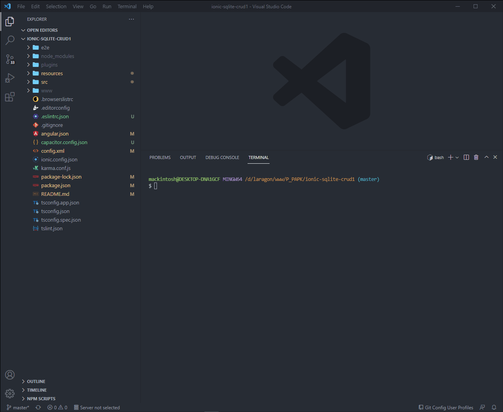

jika prosesnya berhasil nanti akan ada folder baru 👉 `platform` di dalam direktori project kita.

Berikut struktur direktori `platform android`

Struktur direktori ini akan bergantung dari jenis project yang kita buat. Misalnya project `ios`, tentu akan berbeda dengan yang ini.

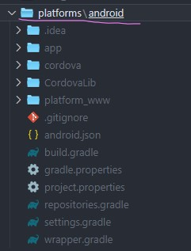

Sedikit saya akan bahas tentang `Gradle` karena fungsi **gradle wajib diketahui**. menurut dokumentasinya [Gradle](https://docs.gradle.org/current/userguide/userguide.html) akan membantu kita dalam mengembangkan aplikasi android, bahkan tidak hanya android saja.

[Gradle](https://docs.gradle.org/current/userguide/userguide.html) juga dapat digunakan untuk mengembangkan aplikasi lain, seperti Web, Desktop, Bot, dll.

Apa kegunaanya di ionic?

Mengapa kita harus menggunakan Gradle?

Mari kita bahas…

[Gradle](https://docs.gradle.org/current/userguide/userguide.html) adalah sebuah program yang berfungsi untuk melakukan `build` secara otomatis. Karena itu, Gradle sering disebut sebagai `build-tool.`

`Build` di sini bisa kita artikan sebagai aktivitas melakukan `compile` dan `packaging.`

Begitulah cara menggunakan gradle untuk project di ionic.

#### Ok, Yang terakhir?

Kita akan langsung build ke `android platform`. yang nantinya akan `menggenerate APK` files. Gunakan perintah berikut:

```bash
# Android
ionic cordova build android
```
Pastikan terkoneksi dengan internet dan silahkan tunggu prosessnya... 🍿☕

```bash
mackintosh@DESKTOP-DNA1GCF MINGW64 /d/laragon/www/P_PAPK/ionic-sqlite-crud1 (master)
$ ionic cordova build android
> ng.cmd run app:ionic-cordova-build --platform=android
✔ Browser application bundle generation complete.
✔ Copying assets complete.
✔ Index html generation complete.

Initial Chunk Files          | Names                     |      Size
vendor.js                    | vendor                    |   4.58 MB
polyfills.js                 | polyfills                 | 252.39 kB
cordova.js                   | cordova                   |  61.79 kB
styles.css                   | styles                    |  30.74 kB
main.js                      | main                      |  13.89 kB
runtime.js                   | runtime                   |   9.58 kB

                             | Initial Total             |   4.94 MB

Lazy Chunk Files             | Names                     |      Size
swiper-bundle-6c5e7804-js.js | swiper-bundle-6c5e7804-js | 200.12 kB
polyfills-core-js.js         | polyfills-core-js         |  92.39 kB
11.js                        | -                         |  72.67 kB
17.js                        | -                         |  72.49 kB
2.js                         | -                         |  65.16 kB
33.js                        | -                         |  56.88 kB
26.js                        | -                         |  47.79 kB
1.js                         | -                         |  47.73 kB
31.js                        | -                         |  37.46 kB
30.js                        | -                         |  32.95 kB
21.js                        | -                         |  32.52 kB
19.js                        | -                         |  32.41 kB
16.js                        | -                         |  32.32 kB
6.js                         | -                         |  32.18 kB
0.js                         | -                         |  30.07 kB
25.js                        | -                         |  27.27 kB
20.js                        | -                         |  26.79 kB
12.js                        | -                         |  26.41 kB
29.js                        | -                         |  25.24 kB
32.js                        | -                         |  24.53 kB
36.js                        | -                         |  24.00 kB
23.js                        | -                         |  21.94 kB
40.js                        | -                         |  21.85 kB
22.js                        | -                         |  21.10 kB
15.js                        | -                         |  20.55 kB
polyfills-dom.js             | polyfills-dom             |  19.47 kB
39.js                        | -                         |  18.33 kB
42.js                        | -                         |  18.16 kB
common.js                    | common                    |  17.37 kB
41.js                        | -                         |  16.99 kB
7.js                         | -                         |  15.95 kB
4.js                         | -                         |  15.86 kB
shadow-css-a3f00b33-js.js    | shadow-css-a3f00b33-js    |  15.82 kB
24.js                        | -                         |  15.81 kB
10.js                        | -                         |  15.70 kB
input-shims-73f15161-js.js   | input-shims-73f15161-js   |  15.39 kB
18.js                        | -                         |  15.15 kB
14.js                        | -                         |  12.96 kB
27.js                        | -                         |  12.04 kB
8.js                         | -                         |  11.43 kB
polyfills-css-shim.js        | polyfills-css-shim        |  10.67 kB
9.js                         | -                         |   9.73 kB
35.js                        | -                         |   9.28 kB
34.js                        | -                         |   7.85 kB
37.js                        | -                         |   7.80 kB
create-create-module.js      | create-create-module      |   7.72 kB
edit-edit-module.js          | edit-edit-module          |   7.59 kB
28.js                        | -                         |   5.98 kB
keyboard-5742b5da-js.js      | keyboard-5742b5da-js      |   5.97 kB
3.js                         | -                         |   5.88 kB
tap-click-cc1ae2b2-js.js     | tap-click-cc1ae2b2-js     |   5.53 kB
13.js                        | -                         |   3.44 kB
5.js                         | -                         |   3.33 kB
swipe-back-fae97365-js.js    | swipe-back-fae97365-js    |   2.69 kB
status-tap-5c3a5bca-js.js    | status-tap-5c3a5bca-js    |   2.06 kB
focus-visible-f4ad4f1a-js.js | focus-visible-f4ad4f1a-js |   1.92 kB
38.js                        | -                         |   1.64 kB

Build at: 2021-10-19T15:42:04.323Z - Hash: 19e2774a21fcdd1af49b - Time: 36889ms
> cordova.cmd build android
Checking Java JDK and Android SDK versions
ANDROID_SDK_ROOT=C:\Users\mackintosh\AppData\Local\Android\Sdk (recommended setting)
ANDROID_HOME=undefined (DEPRECATED)
Using Android SDK: C:\Users\mackintosh\AppData\Local\Android\Sdk

Welcome to Gradle 6.9.1!

Here are the highlights of this release:
 - This is a small backport release.
 - Java 16 can be used to compile when used with Java toolchains
 - Dynamic versions can be used within plugin declarations
 - Native support for Apple Silicon processors

For more details see https://docs.gradle.org/6.9.1/release-notes.html

Starting a Gradle Daemon (subsequent builds will be faster)

BUILD SUCCESSFUL in 7s
1 actionable task: 1 executed
Subproject Path: CordovaLib
Subproject Path: app
Downloading https://services.gradle.org/distributions/gradle-6.5-all.zip
.............10%..............20%..............30%..............40%..............50%..............60%..............70%..............80%..............90%..............100%

Welcome to Gradle 6.5!

Here are the highlights of this release:
 - Experimental file-system watching
 - Improved version ordering
 - New samples

For more details see https://docs.gradle.org/6.5/release-notes.html

Starting a Gradle Daemon (subsequent builds will be faster)
Warning: Mapping new ns http://schemas.android.com/repository/android/common/02 to old ns http://schemas.android.com/repository/android/common/01
Warning: Mapping new ns http://schemas.android.com/repository/android/generic/02 to old ns http://schemas.android.com/repository/android/generic/01
Warning: Mapping new ns http://schemas.android.com/sdk/android/repo/addon2/02 to old ns http://schemas.android.com/sdk/android/repo/addon2/01
Warning: Mapping new ns http://schemas.android.com/sdk/android/repo/repository2/02 to old ns http://schemas.android.com/sdk/android/repo/repository2/01
Warning: Mapping new ns http://schemas.android.com/sdk/android/repo/sys-img2/02 to old ns http://schemas.android.com/sdk/android/repo/sys-img2/01

> Task :app:stripDebugDebugSymbols
WARNING: Compatible side by side NDK version was not found. Default is 21.0.6113669.
Compatible side by side NDK version was not found. Default is 21.0.6113669.
Unable to strip the following libraries, packaging them as they are: libsqlc-ndk-native-driver.so.

> Task :app:compileDebugJavaWithJavac
Note: Some input files use or override a deprecated API.
Note: Recompile with -Xlint:deprecation for details.

Deprecated Gradle features were used in this build, making it incompatible with Gradle 7.0.
Use '--warning-mode all' to show the individual deprecation warnings.
See https://docs.gradle.org/6.5/userguide/command_line_interface.html#sec:command_line_warnings

BUILD SUCCESSFUL in 9m 58s
41 actionable tasks: 41 executed
Built the following apk(s): 
        D:\laragon\www\P_PAPK\ionic-sqlite-crud1\platforms\android\app\build\outputs\apk\debug\app-debug.apk

mackintosh@DESKTOP-DNA1GCF MINGW64 /d/laragon/www/P_PAPK/ionic-sqlite-crud1 (master)
$
```

Jika build-nya berhasil silahkan cek `APK-nya` di folder berikut:

```Bash
D:\laragon\www\P_PAPK\ionic-sqlite-crud1\platforms\android\app\build\outputs\apk\debug\app-debug.apk
```
Copy & install `app-debug.apk` nya ke `device android` kalian. 

Selanjutnya silahkan test apakah proses CRUD nya berhasil. 🎉

[](https://youtu.be/USEl9KwPH5c "PAPK")

## Conclusion

So, Materi untuk pertemuan ke - 4 ini selesai. Dalam materi ini, kita belajar cara membuat aplikasi seluler Ionic dengan implementasi proses CRUD didalamnya. 

Tidak hanya itu, kita juga belajar memahami proses pembuatan aplikasi _cross-platform_ secara bertahap yang sifatnya [reusable code]( https://en.wikipedia.org/wiki/Code_reuse) yang artinya kode tersebut dapat digunakan kembali pada platform lain.

Yoss....., tetap Semangat!! 🤩 Masih banyak hal-hal keren yang nanti akan kita pelajari di matkul ini. 🙈

## Referensi

<a id="1">[1].</a>
https://ionicframework.com/docs/angular/your-first-app/6-deploying-mobile

<a id="2">[2].</a>
https://docs.gradle.org/current/userguide/userguide.html

[3]. [https://ionicframework.com/docs/v3/cli/cordova/build/](https://ionicframework.com/docs/v3/cli/cordova/build/)

[4]. [https://ionicframework.com/docs/developing/android](https://ionicframework.com/docs/developing/android)

