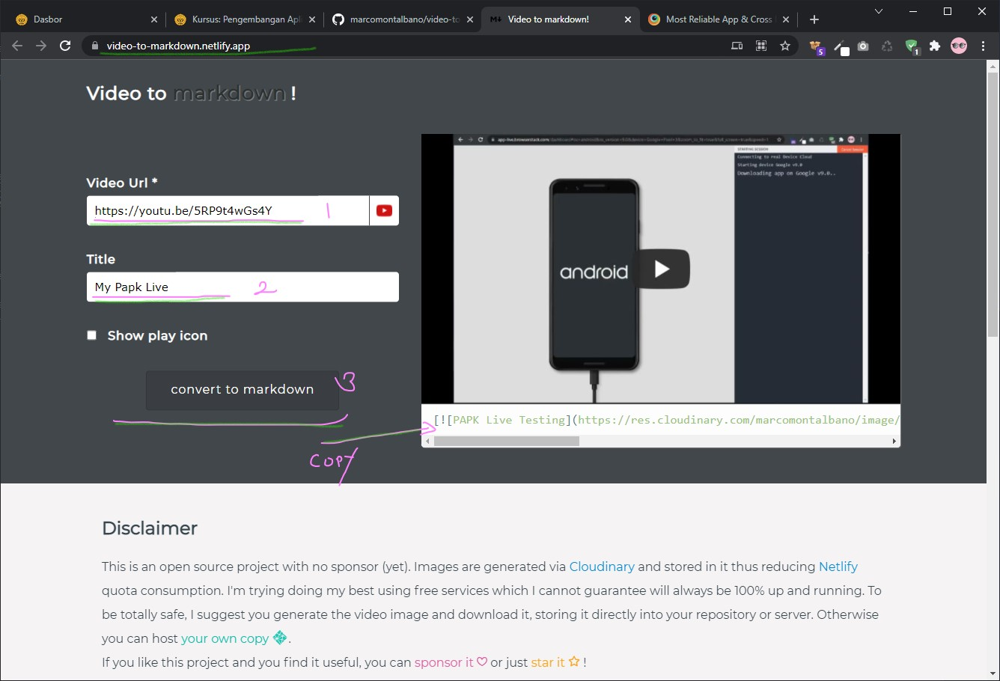
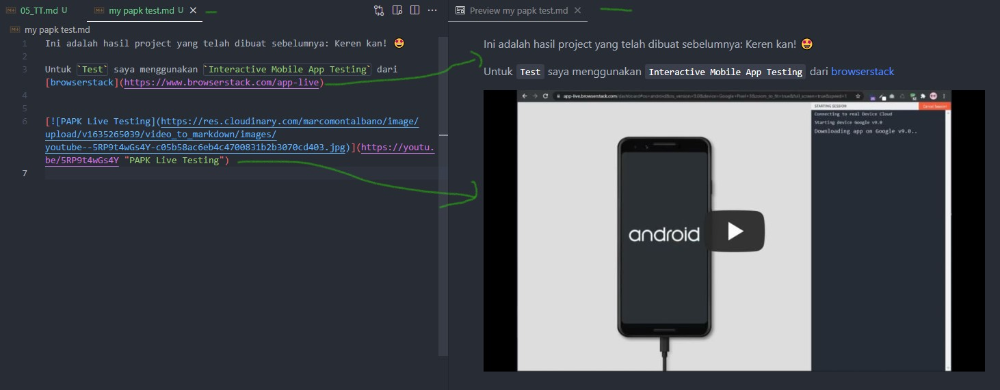

[](https://youtu.be/USEl9KwPH5c "PAPK")

Dalam Pertemuan `Ke - 05` ini. Silahkan temen-temen test project apps yang telah di build sebelumnya.

Untuk Test Project berikut ada 2 cara. Silahkan pilih sesuai selera ya.. 🤹‍♀️


# Step 1: Install On Real Devices:

copy `app-debug.apk` ke android devices kalian kemudian lakukan install.


## Step 2: Via app-live browserstack

[BrowserStack](https://www.browserstack.com/) adalah _platform_ pengujian web dan seluler cloud India yang memberi pengembang kemampuan untuk menguji situs web dan aplikasi seluler mereka di seluruh browser sesuai permintaan, sistem operasi, dan perangkat seluler nyata. Mereka memiliki empat produk utama: `Live,` `App Live`, `Automate`, dan `App Automate`. Source: -*Wikipedia*

**Bagaimana Cara Kerjanya?**

Silahkan simak video berikut:

[](https://youtu.be/5RP9t4wGs4Y "PAPK Live Testing")

## Step 3: Tugas anda adalah..

1. Record Project anda
2. Run Proses CRUD dalam apps tersebut.
3. Upload ke youtube/googledrive 
4. Copy tautan video project anda ke tautan: [video-to-markdown.netlify.app/](https://video-to-markdown.netlify.app/) . lihat gambar berikut: 
   


klik `convert to markdown` . Selanjutnya buat `new file` dengan `format markdown (.md)`

```markdown
Contoh : my papk test.md (silahkan untuk penaaman sesuai selera)
```
Selanjutnya copy hasil convert `video to markdown` seperti contoh dibawah ini ke `file` `markdown.md` anda.

```markdown
[](https://youtu.be/5RP9t4wGs4Y "PAPK Live Testing")
```

Hasilnya akan seperti ini:




>>Untuk contoh lebih spesifiknya bisa lihat di repositori, semua modul praktikum saya buat menggunakan penulisan `markdown.md`

5. Terakhir `PUL Request` ya! 🌟🌟🌟🌟


## Referensi

1. [video-to-markdown](https://github.com/marcomontalbano/video-to-markdown)
2. [browserstack](https://www.browserstack.com/)
3. [markdownguide](https://www.markdownguide.org/cheat-sheet/)