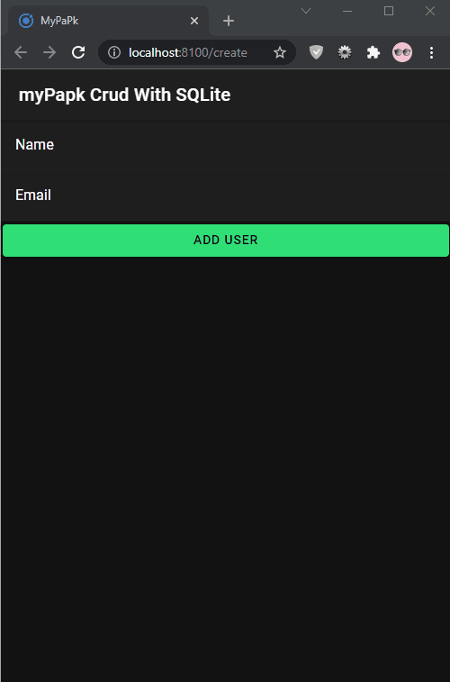

<h1>Test Browser targeted deployment Ionic</h1>

Pada praktikum Ke-03 sebelumnya kita sudah mempelajari proses pembuatan aplikasi *cross-platform* di ionic dengan mengimplementasikan proses CRUD di dalamnya. 

Temen-temen masih ingat ga? 🤔 

Pada saat run project di dev server kita tidak bisa melakukan proses CRUD tersebut. 😔

Di Praktikum Ke-06 ini kita akan coba deploy project ionic yang sebelumnya kita buat ke `browser platform` dengan menggunakan plugin [Cordova-Browser](https://www.npmjs.com/package/cordova-browser). Yang nantinya dapat menjalankan dan men-debug aplikasi menggunakan browser web tanpa harus penerapan ke `real device` atau `emulator`.

*let's get started ..* 

## Referensi

1. [package/cordova-browser](https://www.npmjs.com/package/cordova-browser)
2. [cordova.apache.org](https://cordova.apache.org/announcements/2019/02/04/cordova-browser-6.0.0.html)